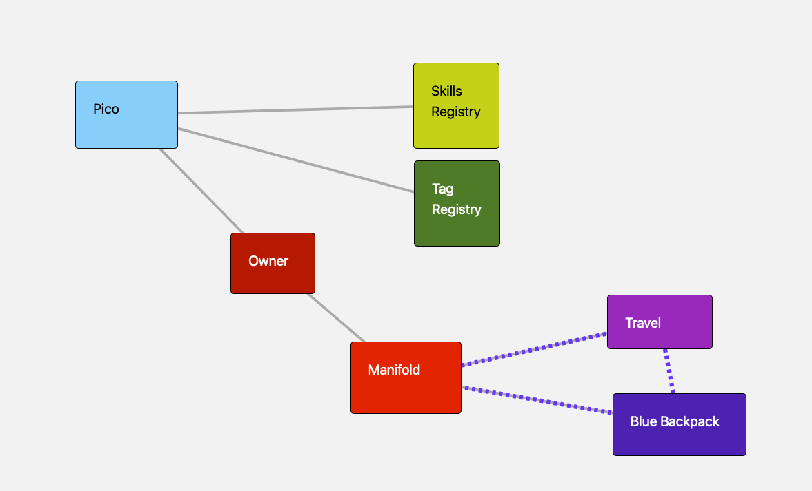

# manifold-api

Manifold is a framework for the [pico engine](https://github.com/Picolab/pico-engine) that enables the creation and orchestration of pico-based systems. These rulesets define the behavior of pico devices in the Manifold ecosystem.

This repository contains KRL (Kynetx Rules Language) rulesets for [Manifold](https://manifold.picolabs.io/), updated for compatibility with Pico Engine version 1.0.

## Architecture



The root pico hosts the tag registry and owner pico. The owner pico manages the Manifold pico, which creates and orchestrates thing and community picos (solid lines: parent/child; dashed lines: subscriptions between picos).

## Ruleset Status

### Updated for Pico Engine 1.0

Core platform rulesets — covered by the integration test harness ([`t/README.md`](t/README.md)):

- ✅ **`io.picolabs.manifold_bootstrap.krl`** — One-step bootstrap automation for the root pico
- ✅ **`io.picolabs.new_tag_registry.krl`** — Refactored for Pico Engine 1.0
- ✅ **`io.picolabs.manifold.skills_registry.krl`** — Skills registry child pico
- ✅ **`io.picolabs.profile.krl`** — Updated for Pico Engine 1.0; flat `ent:profile` contact fields
- ✅ **`io.picolabs.manifold_owner.krl`** — Uses modern Wrangler API; updated channel creation and ruleset installation patterns
- ✅ **`io.picolabs.manifold_pico.krl`** — Thing/community management, thing-creation delegation (`callback_eci`/`rcn`), notification init RS installs
- ✅ **`io.picolabs.thing.krl`** — Community support: `communities()`, `autoAcceptCommunity`, `communityAdded`/`communityRemoved`, `notifyCommunity`
- ✅ **`io.picolabs.community.krl`** — Full community/thing subscription system: `things()`, `autoAcceptManifold`/`autoAcceptThing`, `addThing`, `broadcastThingEvent`
- ✅ **`io.picolabs.safeandmine.krl`** — Partially updated; tags not yet working
- ✅ **`io.picolabs.notifications.krl`** — Notification orchestrator (Manifold inbox + SMS + Prowl channels)
- ✅ **`io.picolabs.twilio.sms.krl`** — SMS delivery module (replaces `io.picolabs.twilio_notifications`)
- ✅ **`io.picolabs.prowl.krl`** — Prowl push module (replaces `io.picolabs.prowl_notifications`)
- ✅ **`io.picolabs.journal.krl`** — Reviewed for Pico Engine 1.0; optional standalone journal (not part of bootstrap)

**Note:** **`io.picolabs.safeandmine.krl`** is installed on thing picos via tests but tags are not yet working.

### Pending review

None at repo root — all active Manifold platform rulesets are reviewed. Archived and experimental rulesets may exist locally under `OLD/` or `fix/`; those directories are gitignored and not published in this repo.

### Removed / superseded

These rulesets were deleted and replaced by the notification platform refactor:

| Removed | Replaced by |
|---------|-------------|
| `io.picolabs.prowl_notifications.krl` | `io.picolabs.prowl.krl` |
| `io.picolabs.twilio_notifications.krl` | `io.picolabs.twilio.sms.krl` |
| `io.picolabs.manifold.text_message_notifications` | `io.picolabs.twilio.sms.krl` (via `notifications`) |
| `io.picolabs.manifold.text_messenger.krl` | `io.picolabs.twilio.sms.krl` (via `notifications`) |

## Bootstrap

### Option 1: Automated (recommended)

1. Start your pico engine with the root pico as the top-level parent.
2. Install **`io.picolabs.manifold_bootstrap`** on the root pico.
3. Query `getBootstrapStatus()` on the root pico's **bootstrap** channel to get the ECIs for the tag registry and owner pico.

### Option 2: Manual

**Three-part initialization sequence:**

1. **Tag registry pico** — Create a child of the root pico; install `io.picolabs.new_tag_registry`. Note the `registration` channel ECI.
2. **Owner pico** — Create a child of the root pico; install `io.picolabs.profile` and `io.picolabs.manifold_owner`. This automatically creates the Manifold child pico and installs `io.picolabs.manifold_pico`.
3. **Tag server registration** — Raise `manifold:new_tag_server` with the tag registry's `registration` ECI to the owner pico **before creating any things**.

```
Root Pico
  ├─ Tag Registry Pico → io.picolabs.new_tag_registry
  └─ Owner Pico → io.picolabs.profile + io.picolabs.manifold_owner
       └─ Manifold Pico → io.picolabs.manifold_pico (auto-installed)
```

## Core Rulesets

| Ruleset | Installed On | Purpose |
|---|---|---|
| `io.picolabs.manifold_bootstrap` | Root pico | Automates full bootstrap |
| `io.picolabs.new_tag_registry` | Tag registry pico | Tag registry |
| `io.picolabs.manifold.skills_registry` | Skills registry pico | Skills registry |
| `io.picolabs.profile` | Owner pico | User profile / contact info |
| `io.picolabs.manifold_owner` | Owner pico | Manages Manifold child pico |
| `io.picolabs.manifold_pico` | Manifold pico | Thing/community management, notifications init |
| `io.picolabs.notifications` | Manifold pico | Notification orchestrator |
| `io.picolabs.twilio.sms` | Manifold pico | SMS delivery |
| `io.picolabs.prowl` | Manifold pico | Prowl push delivery |
| `io.picolabs.thing` | Thing picos | Base thing behavior |
| `io.picolabs.community` | Community picos | Base community behavior |
| `io.picolabs.safeandmine` | Thing picos | Safe and Mine integration |

## Dependencies

All rulesets depend on standard pico engine modules provided by the engine itself:
- `io.picolabs.wrangler` — pico management
- `io.picolabs.subscription` — subscription management

## Accessing Manifold

After bootstrapping, access functionality via:
- Sky Cloud queries: `GET /sky/cloud/{eci}/{ruleset}/{function}`
- Sky Events: `POST /sky/event/{eci}/{eid}/{domain}/{type}`

## Integration tests

This repo includes a local TypeScript integration test harness in [`t/`](t/). Tests run against a **real pico-engine** in Docker with this repo bind-mounted as `file://` ruleset URLs — edit KRL, re-run, iterate without rebuilding the image.

**Prerequisites:** Docker, Node.js 18+, and the `picolabs/pico-engine` image. One-time setup:

```bash
npm install
```

**Quick commands** (from the repo root):

| Command | What it does |
|---------|----------------|
| `npm test` | Parse gate → Docker → bootstrap + scenarios → teardown |
| `npm run test:parse` | KRL syntax check only (no Docker) |
| `npm run test:keep` | Full run; leave container up for inspection |
| `npm run test:cleanup` | Remove leftover test containers and `/tmp` pico homes |

Current scenarios cover Manifold bootstrap (tag registry, owner, Manifold pico), and thing/community create/add/remove/delete flows.

**Full documentation** — prerequisites, flags, failed-run inspection, writing scenarios, and config — is in **[`t/README.md`](t/README.md)**.

The sibling **sensor-network** repo reuses this harness via `dependsOn` and `manifoldApiPath` (default `../manifold-api`); see its `t/README.md`.

## File Conventions

- All rulesets use the `.krl` extension (some legacy files omit it but are valid KRL)
- Ruleset IDs match the filename (e.g., `io.picolabs.manifold_owner.krl` → RID `io.picolabs.manifold_owner`)

## Contributing

When contributing KRL rulesets:
- Follow KRL best practices
- Document dependencies in the `meta` section
- Note Pico Engine version compatibility

For more information about KRL and Pico Labs, visit [picolabs.io](http://picolabs.io).
